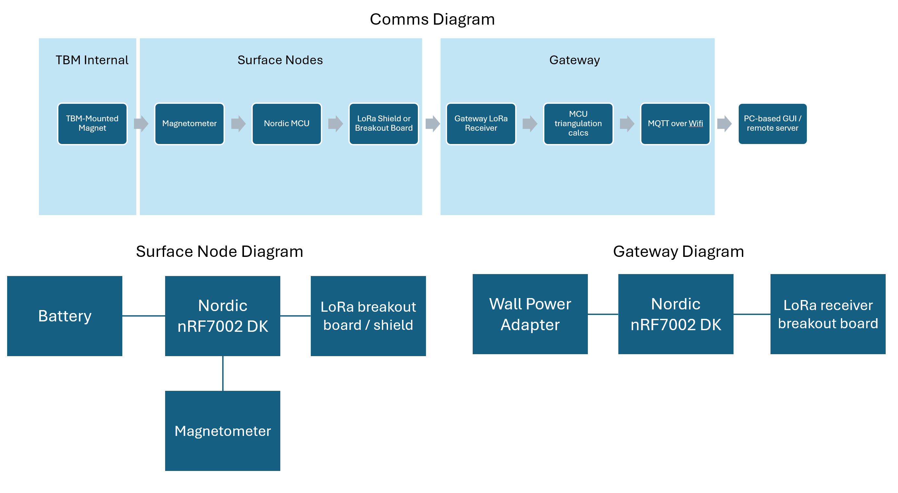

# IoT Venture Pitch

## ESE5180: IoT Wireless, Security, & Scaling

**Team Name:**

| Team Member Name | Email Address             |
| ---------------- | ------------------------- |
| jefferson ding   | tyding@seas.upenn.edu     |
| sophia fu        | sophiafu@seas.upenn.edu   |
| gabriel zhang    | jgzhang@wharton.upenn.edu |
| mia wang         | wxm@seas.upenn.edu        |

**GitHub Repository URL:** https://github.com/ese5180/iot-venture-f25-misogaje

## Concept Development

### Product Function

The system provides continuous micro tunnel boring machine (TBM) navigation underground without relying on noisy internal IMUs or vulnerable electronics inside the machine, which also removes excessive wiring and single points of failure. Surface nodes detect the magnetic field of the TBM-mounted magnet, and the gateway triangulates position and heading using a dipole solver. This data is transmitted via LoRa from nodes to the gateway and then via Wi-Fi MQTT to operators and remote servers.

### Target Market & Demographics

#### Who will be using the product?

HDD and microtunneling site engineersTBM operators who need continuous bearing of their machine, but lasers are too expensive, and other methods like IMU are not accurate enough and are failure-prone.

#### Who will be purchasing the product?

Trenchless contractors (HDD, MTBM, pipe jacking), municipal utility owners/EPCs, and rental fleets; college design teams (e.g., Penn Hyperloop) as pilots.

#### Where will you deploy it?

North America & EU urban/suburban jobs with ~1–3 m cover (street right-of-way, utility corridors).

First field test: Bastrop, TX.

#### How large is the market you’re targeting (USD)?

Beachhead market: Microtunneling (MTBM)

Recent reports place the global MTBM/microtunneling machine market roughly in the $1.1–1.5B (2024) range. Using a realistic 1–3% “instrumentation/guidance add-on” instead of a full rig, our TAM ≈ $11–45M per year. Regionally, microtunneling is concentrated in NA + EU ≈ ~60% of spend.

Expanded opportunity, after MTBM sucess

Adding adjacent install categories: HDD $9.90B (2024), Pipe Jacking ≈ $1.2B (2024), Horizontal Auger Boring ≈ $0.33–0.41B (2024–31). Summed with MTBM yields ≈ $12.5–13.0B of trenchless install equipment spend. Applying the same 1–3% attach rate ⇒ extended TAM ≈ $126–379M per year.

#### How much of that market do you expect to capture (USD)?

SAM: Use NA + EU ≈ 60% of the MTBM TAM ⇒ SAM ≈ $6.7–27.0M/yr. For all trenchless construction post pilot trials: $44–156M/yr

SOM: target 1–5% of SAM via direct sales + rentals ⇒ ≈ $0.07–1.35M/yr. For all trenchless construction post pilot trials: $0.44–7.8M/yr

#### What competitors are already in the space?

Microtunneling: VMT (TUnIS Navigation MT / TBM Laser) and related tunneling measurement systems. 

HDD guidance (adjacent/secondary market): Digital Control Inc. (DigiTrak), Underground Magnetics, Subsite Electronics—dominant in walkover locating; useful benchmark for pricing and features. 

### Stakeholders

Penn Hyperloop – immediate competition application in Not-A-Boring Competition (NABC) as a field deployment test.

Other Trenchless companies, including Robbins, Herrenknecht AG, or Komatsu.

Utilities Contractors and government agencies such as Progressive Pipeline Management, Philadelphia Water, Philadelphia Gas Works, or PennDOT.

The Boring Company (TBC) & other full size TBM constructors

#### Cole Kenny, GNC engineer at TBC:

##### Call 1:

Liked that we are trying to avoid electronics inside the TBM and push everything to the surface (eliminating failure points), also a novel method no one did before.

Thought the idea is testable without a tunnel, and that doing wireless removes hassle of laying cables etc.

Points to note:

Whether the magnetic field would be strong enough at 5 ft depth, especially with the steel shell.

Urban magnetic clutter (rebar, vehicles, power lines) and whether we can filter that out.

Surface logistics (laying out and leapfrogging nodes during a dig).

##### Call 2:

Key Positive Feedback

-Comms infrastructure substantially complete:He noted that having LoRa node→gateway comms, Nordic Wi-Fi MQTT uplink, encryption, and OTA update flow already functioning puts us in a good spot: most teams in NABC don't even show up with working MQTT.

-Strong approval for “no electronics inside TBM” design: He described the magnet-on-nose + surface node approach as “simple, robust, and very TBC-style,” minimizing water ingress and vibration failure points.

-High marks for testability: The fact that the system can be fully validated above ground (tripod tests → steel box for attenuation → rail simulation for positioning) is great for lean development and fits well with NABC rules, which requires offline navigation testing without a tunnel.

-Product market potential: Cole remarked that a stable, steel-invariant magnetic system could be useful beyond NABC—including microtunneling contractors and horizontal directional drilling (HDD)—because of its simplicity and no-modification requirement on the TBM.

Concerns Identified

-Magnetic calibration & solver stability: He emphasized that the dipole inversion + EKF solver is the hardest part and warned against heading flips and bias drift if not carefully calibrated.

-Steel distortion of magnetic field: The TBM nose will significantly reshape the magnetic field; we must account for this with: steel-analog test fixtures, offset modeling, and baseline distortion confirmation.

-Environmental noise: External ferrous objects, power generators, and moving machinery can introduce noise. This is not the case for NABC, but it is a risk for real deployments (especially for unmarked metal pipes). He recommended node SNR weighting and robust outlier rejection.

-Operational logistics:Node placement and leapfrogging during a real dig will require a clear SOP, ensuring sensors remain aligned with the TBM path.

Guidance for Next Steps

-Lock the communication architecture (LoRa nodes → LoRa gateway → Nordic MQTT): No more rewrites. Shift fully to sensing and solving.

-Focus engineering effort on the magnetic solver and calibration: Node bias removal, Earth/background subtraction, Heading stability, Weighted dipole fitting, EKF smoothing

-Test with steel before a real TBM: use a low-cost steel pipe or metal cabinet analog to understand field distortion early.

-Prepare inspector-ready evidence: Air-depth test results, Steel-attenuation test, rail demonstration, Live MQTT feed at 0.1 Hz.
These satisfy all NABC navigation rules.

Overall Stakeholder Outlook

Cole described the system as feasible, innovative, and competitive, provided that calibration and heading stability receive focused attention. He reinforced that our progress in communications, encryption, and OTA updates significantly de-risks the project and that our architecture is aligned with TBC engineering philosophy.

### System-Level Diagrams

### Security Requirements Specification

SR-01: All navigation packets over LoRa shall use AES-CCM with a per-packet nonce and monotonic counter.

SR-02: Gateway shall authenticate to MQTT broker before publishing.

SR-03: Logs shall be append-only and tamper-evident using hash chaining with synchronized gateway timestamps.

### Hardware Requirements Specification

HR-01: TBM-mounted magnet (N52, ≥50×20 mm) shall generate ≥1 μT signal at 1.5 m depth.

HR-02: Surface nodes shall include Nordic nRF7002 with SAMD21Pro RF / Other Lora shield, MMC5983MA magnetometer, LoRa antenna, and IP65 housing.

HR-03: Gateway shall be an nRF7002 DK with Wi-Fi capability for MQTT uplink.

HR-04: System shall support ≥10 nodes with 0.1 Hz updates.

### Software Requirements Specification

SRS-01: Firmware shall run Zephyr RTOS on Nordic MCUs.

SRS-02: Nodes shall transmit magnetometer readings at 0.1–1 Hz via LoRa.

SRS-03: Gateway shall fuse ≥3 node readings into TBM position & heading using dipole solver + EKF.

SRS-04: Gateway shall publish telemetry via MQTT in JSON format required  (chainage, easting, northing, elevation, heading:

{ “team”: <string-formatted team name>, “timestamp”: <UNIX timestamp>, “mining”: <boolean mining flag>, “chainage”: <float-formatted chainage in m>, “easting”: <float-formatted easting in m>, “northing”: <float-formatted northing in m>, “elevation”: <float-formatted elevation in m>, “roll”: <float-formatted roll in radians>, “pitch”: <float-formatted pitch in radians>, “heading”: <float-formatted heading in radians>, “extra”: { “optionalSensor”: <data>, “otherOptionalSensor”: <data>, }

### CI Pipeline

Workflow runs on push to main and sophia/ci branches (for testing). Build artifacts and logs can be found in `ci-pipeline-artifacts` folder.
## Financial Modelling and Power Budget

See link here: https://docs.google.com/spreadsheets/d/1R-X6t2DPyomnM5r9wQLkjpDll6tv00gY6B8JL_NzjFE/edit?gid=1607148272#gid=1607148272

## Secure Firmware Updates

### (3.5.1) Draw and describe your bootloading process. Answer the following questions:

Zephyr uses the MCUboot as the bootloader. The application core is updated first by downloading the new app core into mcuboot_secondary memory which is swapped into mcuboot_primary. The net core is then updated by loading the new net core firmware into mcuboot_secondary which is swapped into the net core through the PCD drivers.

**How large is your bootloader?**
Using MCUBoot the bootloader is 30-40kb and our build is 43kb

**How large is your existing application code?**
Our app code is 877kb.

**Does the bootloader or application code handle the firmware image download?**
The application code downloads the firmware image.

**What wireless communication is used to download the images to your device?**
WiFi

**If you have multiple wireless communications at your disposal, why did you choose this method?**
Since we’re using MQTT via WiFi we chose WiFi. BLE wasn't needed as that would require an additional device to perform the firmware update.

**Where are the downloaded firmware images stored?**
AWS S3 Storage Bucket

**What features have you enabled to handle firmware update failures?**
We enabled MCUboot's automatic rollback mechanism which requires new firmware to explicitly confirm itself by calling `img_mgmt_state_confirm()` after a successful boot. If the new firmware crashes or fails to confirm before the next reboot, MCUboot automatically reverts to the previous working firmware version, preventing the device from being bricked by faulty updates.

